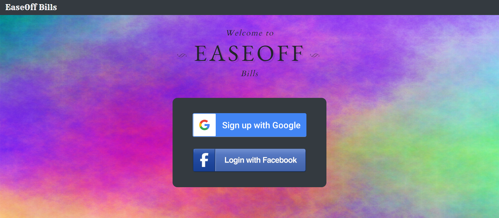
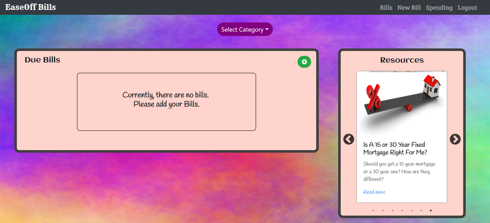
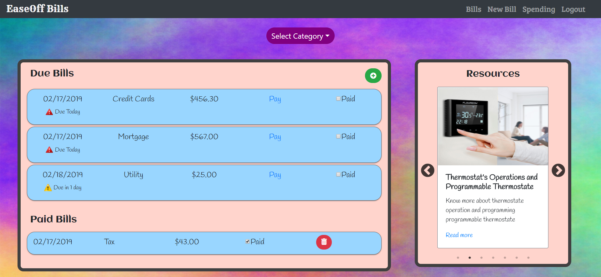
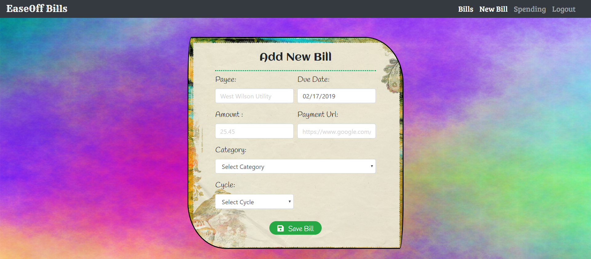
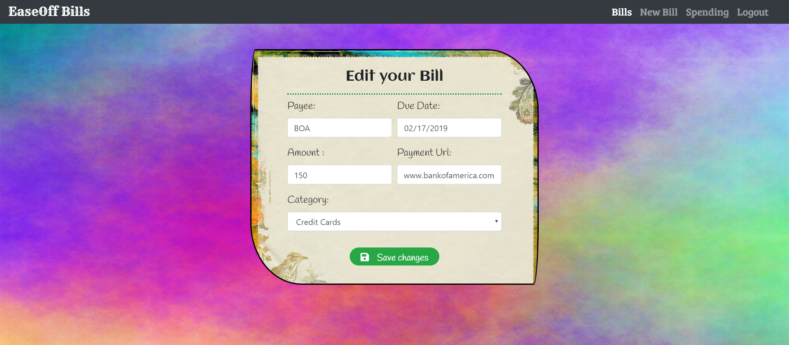
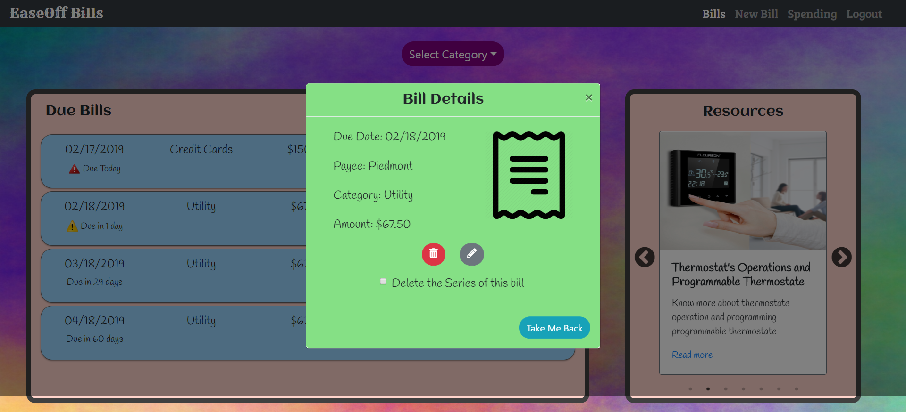
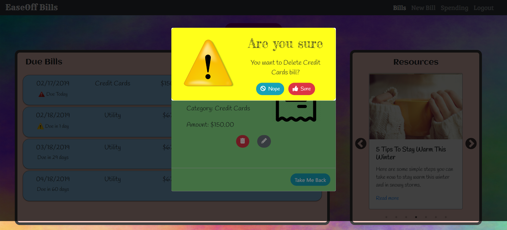
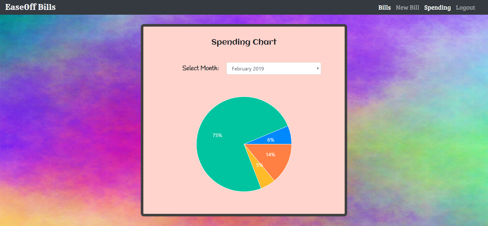

## EaseOff Bills
Got lots of bills and can't remember which one to pay? Just add your bills to EaseOff Bills and it will remember those bills for you. You will know what's due, when it's due and the money you have to put towards it. On top, it will allow you to see amount you are spending towards each category. Users will have access to delete and edit those bills. User will have choice to delete single as well as series of bills. User can click on "Pay" link and it will redirect them to the link to pay that bill. Once the bill is paid, user can check "Paid" box and it will move that bill into "Paid bills" section. Additionally, different types of resources are available to users such as reducing energy bill, tips to stay warm and more. User will have option to categorize due bills and articles.

## Technologies Used
* HTML
* JavaScript
* Bootstrap
* React
* Axios
* Firebase
* CRUD
* Webpack
* Sass
* [Animate CSS](https://daneden.github.io/animate.css/)
* [Recharts](http://recharts.org/en-US/examples/PieChartWithCustomizedLabel)
* [React Slick](https://react-slick.neostack.com/docs/example/pause-on-hover/)

## Screen shots

1. Login Page

2. Main Page

3. With Bills Page

4. New Bill Page

5. Edit Page

6. Bill Details Page

7. Delete Warning Modal

8. Spending Page

## Demo
[Live Demo](https://ease-off-bills-3e50f.firebaseapp.com/)

## How to Run this Project

- Setup Firebase
  - Create a firebase project
  - Enable Google Authentication and Facebook Authentication
  - Create a Firebase Realtime Database. import !base.json and you will see data for articles and bills
  - Click on Articles, and the import the articles.json file. Complete same step for bills.
  - Go to Database tab and click on Rules tab, and add the following rule:
     ` "bills": {
        ".indexOn":"uid"
      },`

- Clone the repository
- Change it to repository directory in your terminal
- At the root of the project run ``npm install`` to install necessary dependencies
- Create an apiKeys.js file (refer to apiKeys.js.example for an example)
- do `npm start` to run the project at ``http://localhost:3000``

## Contributors:
[Ripal Patel](https://github.com/ripalpate/ease-off-bills)
